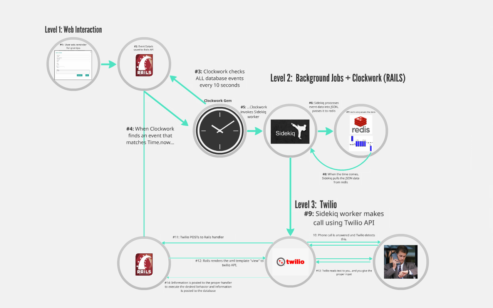
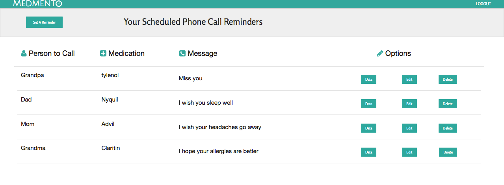
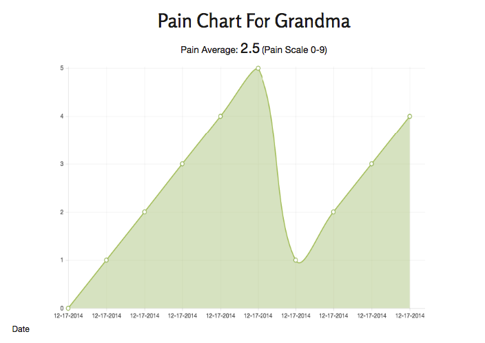
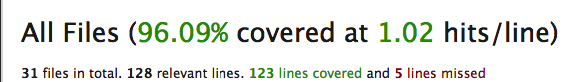

==============

[Medmento](http://kchens.github.io/projects/medmento/medmento-frontend/homepage) is a medication reminder and pain management app for caretakers.

With Medmento, you (the caretaker) can send your loved ones (father, mother, and grandparents) a reminder phone call to take their medication.  You can set a daily reminder, or weekly reminder at any time you choose -- down to the minute. You can also add a personalized message, so your loved ones know you care.

Perhaps just as important, you can track how much pain your loved ones feel *over time*. Our system collects patient data on a 0-9 scale and provides graphical display. Our aim is to help caretakers and their loved ones track the perceived effectiveness of medications.

Other features we may add in the future are:  alerts for when your loved one's pain spikes, email messages to the doctor, and a log how the patient feels each day (a "Twitter" for how they feel). 

##Software Architecture

[Click here for a more detailed look](http://prezi.com/g2kx3qdhe1gd/?utm_campaign=share&utm_medium=copy&rc=ex0share).

####Challenges
By far the biggest challenge we had was implementing a background job at *scheduled* intervals. We looked at a combination of options, but, for one reason or another, they all failed to solve the technical problem we faced. Here are a few options we considered:

- [gem whenever](http://github.com/javan/whenever)
- [gem rufus-scheduler](http://github.com/jmettraux/rufus-scheduler)
- [gem sidetiq](http://github.com/tobiassvn/sidetiq)
- [Heroku Scheduler](http://addons.heroku.com/scheduler)
- Rails 4.2 [Active Jobs](http://edgeguides.rubyonrails.org/active_job_basics.html)
- Resque with [resque-scheduler](http://github.com/resque/resque-scheduler)

Each gem failed for one or a combination of the same reasons: (1) They required us to -- more or less -- write a custom rake task to check and pull event data from the database. (2) The gems were written in Cron, and Cron is only meant for the local environment. (3) The gems did not lend themselves as flexible to use with Sidekiq. (4) The gems did not allow for events to run on specific times down to the minute.

####Our Architecture of Choice
The only ***scalable*** architecture was to use Sidekiq and [Clockwork](http://github.com/tomykaira/clockwork) ***together***. Sidekiq's multi-threaded nature and use of Redis enabled Sidekiq to process jobs in parallel and with a smaller memory footprint -- as compared with other background processing libraries like Delayed Job or Resque. 

##Test-Driving Medmento
As Medmento requires Sidekiq and Redis, we decided not to host our Rails backend on Heroku. If you'd like to test out Medmento on your local environment, follow these steps (on Mac terminal).

####Setting up the Back-end

1. `git clone https://github.com/bluehawk27/medmento_final.git` to this repository onto your local environment: 
2. `rake db:create db:migrate db:seed` in the root directory.
3. Open 5 terminal tabs. Change each tab's directory to the memento root.
4. `redis server` in the first tab.
5. `be sidekiq` in the next tab.
6. `./bin/ngrok 3000` in the next tab. 
	* Copy the ngrok url 
	* Open the `.env` file
	* Paste the ngrok url into `BASE_URL`
7. `rails s` in the next tab.
8. Sign-up for Twilio.
	* Open the `.env` file
	* Copy & paste your `ACCOUNT_SID` and `AUTH_TOKEN` from Twilio into `.env
	* Open `twilio_worker.rb` and replace `CALLER_NUM` with your phone number.
9. `be clockwork config/clock.rb` in the final tab. Clockwork will now start pinging the database at a regular interval.
	* You can change how often clockwork pings the database in the `clock.rb` file. We set Clockwork to check the database every 10 seconds.

####Setting up the Front-end
In the `medmento-frontend` folder, you'll see the static files we used to interact with our Rails API. 

To run these locally, simply (1) open the `index.html` file in your browser. Then, (2) Create, Read, Update, or Delete a reminder!^ See more in "How it Works".

^In `medmento.js`, you can see that the API endpoints default to `localhost:3000` or `medmento.herokuapp.com`. The Heroku App **does not** make a phone call because the API requires Redis and Sidekiq.

##How it works (if you didn't click the Prezi)
Click here to see the front-end:  [Medmento](http://kchens.github.io/projects/medmento/medmento-frontend/homepage). After hitting the homepage, click "Sign In" -> "Log In". 

You'll be brought to this page. Then, you can follow the steps below. NOTE: The backend is not *fully* set-up on Heroku, so you won't receive a phone call.

1. Once logged in, a caretaker clicks "Set A Reminder" button on the top left.

2. The caretaker fills in the name of the loved one, reminder date, and a custom message.

3. Click "Save". The form data is serialized and passed as a JSON object to our Rails API. Similarly, editing or deleting a reminder on  updates or destroys the corresponding event in the back end.

4. When all services are running (check "Setting up the Back-end"), `clockwork` will check the database every 10 seconds (you can set any interval). [Clockwork](http://github.com/tomykaira/clockwork#quickstart) looks for three Time fields in each record of our Events table:  `frequency_quantity`, `frequency_period`, `at`.

5. When the Time fields match the current time (i.e., Time.now), Clockwork invokes our Sidekiq worker -- `TwilioWorker`. Clockwork also passes in the relevant record data to our `TwilioWorker`

6. `TwilioWorker` processes the background job into a JSON and stores the job to Redis. Redis enqueues the job. 

7. When the job time comes, Redis dequeues the job; Sidekiq pulls the data. 

8. `TwilioWorker` makes a call to the Twilio API...to call your loved one -- with your custom message and information.

9. The pain chart should be updated with your loved one's new pain rating.

##Understanding Clockwork
Clockwork checks three fields: `frequency_quantity`, `frequency_period`, `at`. To properly store the the attribute data, you have to understand how Clockwork interprets these three fields. 

The hardest field to understand is `at`, so we've provided a few examples on how to store the data:

| `frequency_quantity` | `frequency_period` | `at` | clockwork interpretation |
|---|---|---|---|
| 1 | week | day, hour & minutes: `Monday 1:30` | "every 1 week on Monday at 1:30AM" |
| 1 | day | hour & minutes: `13:30` | "every 1 day at 1:30PM"|
| 1 | hour | minutes: `**:30` | "every 1 hour at the 30 minute mark" |

As you can see, the `at` data is specified *from* the `frequency_period`. When you want to set a weekly clockwork action, `at` must specify the day of the week, as well as the hour and minute. When you want to specify a daily clockwork action, `at` needs the hour and minute. For an hourly clockwork action, you simply need to provide the minute mark (don't forget the `**`).

##Test Coverage
Using [SimpleCov](http://github.com/colszowka/simplecov), we were able to hit over 95% test coverage on the back-end:

##Contact
If you have any further questions, don't hesitate to reach out to any one of us:

-	Kevin Chen:  [GitHub](http://github.com/kchens), [LinkedIn](http://www.linkedin.com/in/kevinkangchen)
-	John Lin:  [GitHub](http://github.com/johnlin1214), [LinkedIn](http://www.linkedin.com/pub/john-lin/2b/852/a26?trk=pub-pbmap)
-	John Mendez:  [GitHub](http://github.com/jupamedig), [LinkedIn](http://www.linkedin.com/in/juanpablomendez)
-	Alberto Villacorta:  [GitHub](http://github.com/bluehawk27), [LinkedIn](https//www.linkedin.com/in/albertovillacorta)